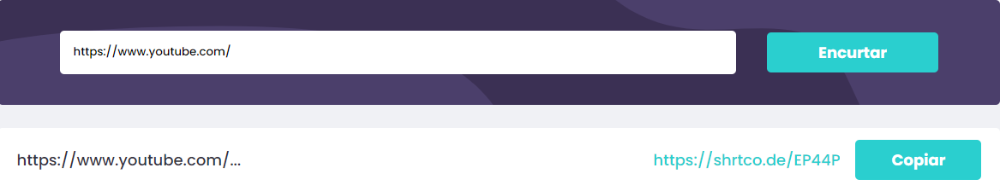
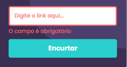
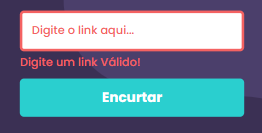

<h1 align="center">Shortly</h1>

<h3 align="center" ><a href="https://ladingpage-rafaelvottoni.netlify.app/">Site Shortly</a> </h3>

  
  Site Responsivo
 

 

Barra de pesquisa

 

Barra de pesquisa carregando

 

Resultado

 

 

 
Erros (input vazio ou erro na requisição)

 

# Sobre

Esta é uma solução para um desafio do site <a href="https://www.frontendmentor.io/">Frontend Mentor </a>, um site que tem como objetivo ajudar quem está começando a desenvolver.
 
O Frontend Mentor disponibiliza o design, as imagens necessarias e a tipografia. E o desafio é construir um site o mais próximo possivel do design original e implementando o que é pedido nas instruções.
 
Nesse desafio foi proposto o desenvolvimento de um site que faz o uso de uma API para encurtar links válidos inseridos pelo usuário.

 

# Tecnologias

As seguintes ferramentas foram usadas na construção do projeto:

- [JavaScript](https://www.javascript.com/)
- [API Shrtcode](https://shrtco.de/)
- HTML
- CSS

 

Feito com ♥ by Rafael Ottoni 

